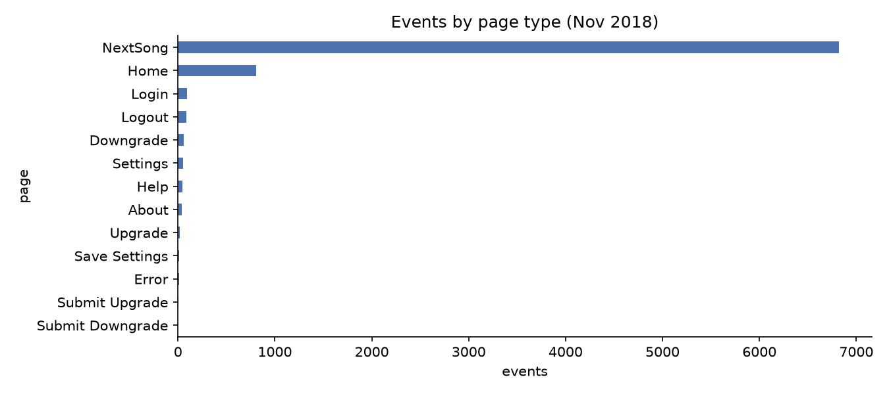
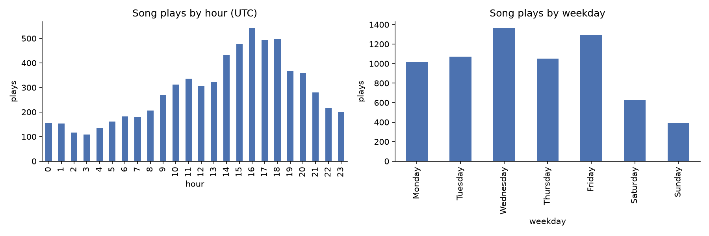
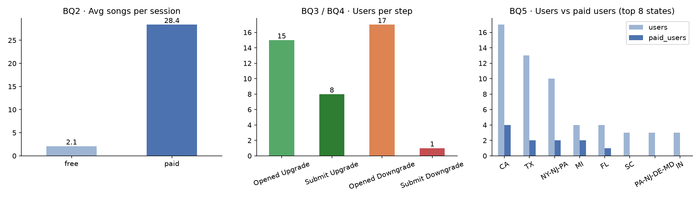
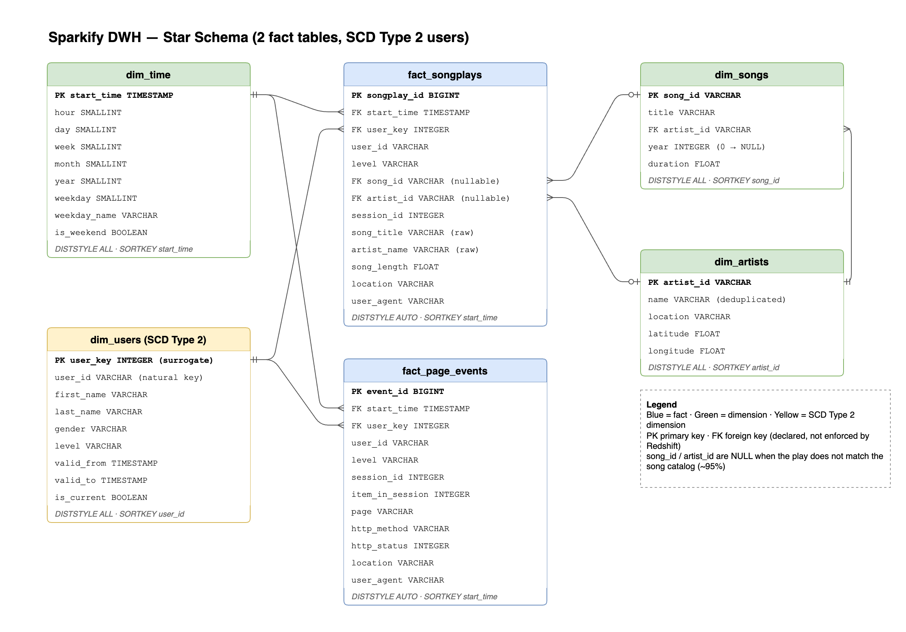
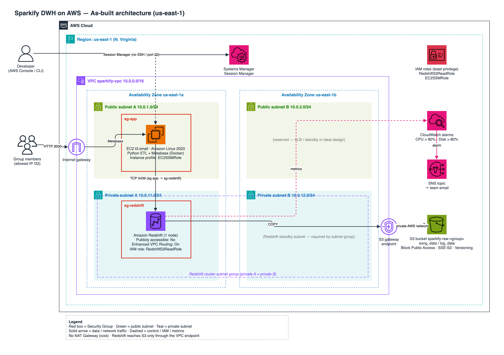
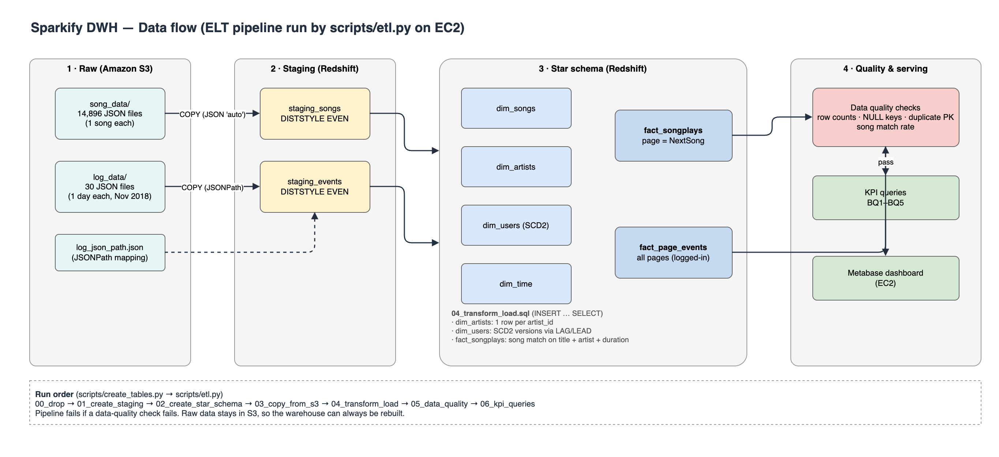
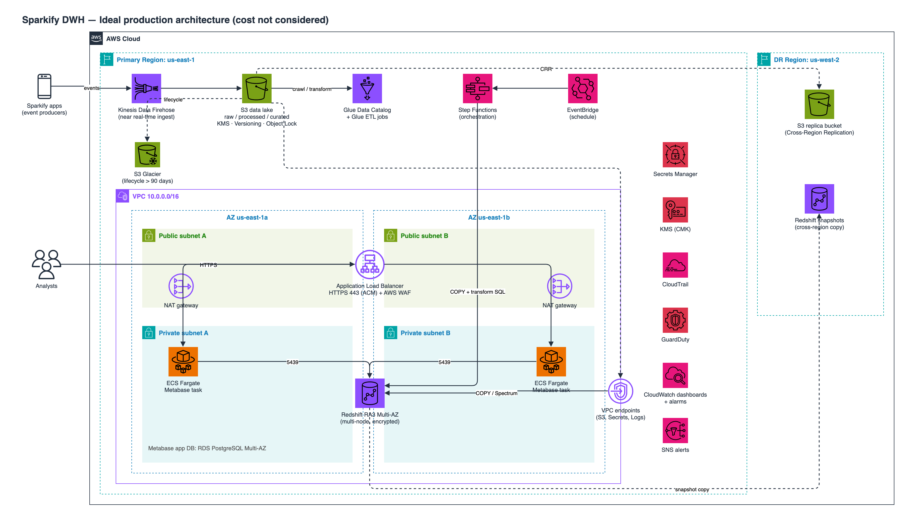

# CHECKPOINT — Sparkify Data Warehouse on AWS

> **วันที่:** 2 ต.ค. 2026 · **สถานะ:** ทำเสร็จ Step 0–5 ตาม [`GUIDELINE_README.md`](GUIDELINE_README.md) (ส่วนออกแบบทั้งหมด)
> **ยังไม่ได้สร้างอะไรบน AWS จริง** และยังไม่ได้แตะ GitHub ทุกอย่างอยู่ในเครื่องเท่านั้น

---

## สารบัญ

1. [ภาพรวมความคืบหน้า](#1-ภาพรวมความคืบหน้า)
2. [การตัดสินใจหลักของโปรเจกต์](#2-การตัดสินใจหลักของโปรเจกต์)
3. [Step 0 — Review README และคู่มือ](#3-step-0--review-readme-และคู่มือ)
4. [Step 1 — เงื่อนไขของงาน](#4-step-1--เงื่อนไขของงาน)
5. [Step 2 — โครงโฟลเดอร์โปรเจกต์](#5-step-2--โครงโฟลเดอร์โปรเจกต์)
6. [Step 3 — โหลดข้อมูล + Data Profiling + Business Questions](#6-step-3--โหลดข้อมูล--data-profiling--business-questions)
7. [Step 4 — Data Model (Star Schema + SCD Type 2)](#7-step-4--data-model-star-schema--scd-type-2)
8. [Step 5 — AWS Architecture](#8-step-5--aws-architecture)
9. [สิ่งที่ทำให้งานเป็นของกลุ่มเราเอง (ไม่ใช่แค่ก๊อป Udacity)](#9-สิ่งที่ทำให้งานเป็นของกลุ่มเราเอง)
10. [ไฟล์ทั้งหมดที่สร้าง](#10-ไฟล์ทั้งหมดที่สร้าง)
11. [สิ่งที่ยังไม่ได้ทำ / ข้อควรระวัง](#11-สิ่งที่ยังไม่ได้ทำ--ข้อควรระวัง)
12. [ขั้นตอนถัดไป](#12-ขั้นตอนถัดไป)

---

## 1. ภาพรวมความคืบหน้า

| Step | งาน | สถานะ | Output หลัก |
|---|---|---|---|
| 0 | Review README + คู่มือ | ✅ เสร็จ | รายการจุดที่ต้องแก้ใน README เดิม |
| 1 | เช็คเงื่อนไขงาน / AWS | ✅ เสร็จ | การตัดสินใจหลัก (ข้อ 2) |
| 2 | โครงโฟลเดอร์ในเครื่อง | ✅ เสร็จ | โฟลเดอร์ `docs/ sql/ scripts/ config/ screenshots/`, `.gitignore`, `PROJECT_README.md` |
| 3 | โหลดข้อมูล + Profiling + Business Questions | ✅ เสร็จ | `data/raw/`, `notebooks/01_data_profiling.ipynb`, BQ 5 ข้อ |
| 4 | Data Model | ✅ เสร็จ (ออกแบบ) | `docs/data_model.md`, ERD (draw.io + Mermaid) |
| 5 | AWS Architecture Diagram | ✅ เสร็จ | `docs/architecture.md`, diagram 3 หน้า |
| 6 | Build บน AWS + เขียน SQL/ETL | ⏳ ยังไม่เริ่ม | — |
| 7 | 4 Pillars | ⏳ ยังไม่เริ่ม (มีร่างใน `architecture.md` §7) | — |
| 8 | Cost Estimate | ⏳ ยังไม่เริ่ม | — |
| 9 | รูปเล่มรายงาน | ⏳ ยังไม่เริ่ม | — |
| 10 | Cleanup | ⏳ หลังส่งงาน | — |

---

## 2. การตัดสินใจหลักของโปรเจกต์

| เรื่อง | ตัดสินใจ | เหตุผลสั้น ๆ |
|---|---|---|
| สิ่งที่ต้องส่ง | รูปเล่ม + diagram + GitHub link · deadline เดือนหน้า · 30 คะแนน · กลุ่ม 5 คน | จากอาจารย์ (ไม่มีเกณฑ์ละเอียด) |
| AWS account | Account ปกติ (อาจารย์จ่าย) ไม่ใช่ Learner Lab | สร้าง IAM Role เองได้ แต่ **เสียเงินจริง** ต้องระวัง cost |
| Region | `us-east-1` | ถูกที่สุด, service ครบ |
| Data Warehouse | Redshift **provisioned 1 node** | Pause ได้, อยู่ใน VPC ของเรา → วาด network ได้ชัด |
| Dashboard | **Metabase บน EC2** | ฟรี (QuickSight มีค่ารายเดือนต่อ user) |
| เข้า EC2 | **Session Manager** (ไม่เปิด SSH port 22) | ปลอดภัยกว่า ได้คะแนน security |
| Monitoring | **CloudWatch alarm + SNS email** | ได้คะแนนเพิ่ม |
| `dim_users` | **SCD Type 2** | เก็บประวัติ free ↔ paid ซึ่ง BQ3/BQ4 ใช้ตรง ๆ |
| ERD | ทั้ง **draw.io** และ **Mermaid** | ให้กลุ่มเลือกเอง |
| ภาษาเอกสาร | ภาษาอังกฤษ | — |
| ลำดับการทำงาน | ออกแบบให้เสร็จก่อน แล้วค่อยเขียน DDL / build | ลดการแก้ไปมา |

---

## 3. Step 0 — Review README และคู่มือ

อ่าน [`README.md`](README.md) (Sparkify ต้นฉบับ) เทียบกับสิ่งที่วิชา Cloud ให้คะแนน แล้วพบว่า:

| ปัญหาใน README เดิม | ผลกระทบ | แก้แล้วหรือยัง |
|---|---|---|
| ไม่มี Infrastructure เลย (VPC / SG / IAM / monitoring) | ขาดแก่นของวิชา Cloud | ✅ ออกแบบใน Step 5 |
| เป็นโปรเจกต์ Udacity ที่คนทำเยอะมาก | เสี่ยงถูกมองว่าก๊อป | ✅ เพิ่ม BQ ใหม่ 3 ข้อ, fact table ที่ 2, SCD2, network design (ดูข้อ 9) |
| `DISTKEY(song_id)` บน fact | `song_id` เป็น NULL ~95% → data skew | ✅ เปลี่ยนเป็น `DISTSTYLE AUTO` |
| ใช้ bucket `s3://udacity-dend` ของคนอื่น | อาจถูกปิดเมื่อไหร่ก็ได้ | ✅ โหลดมาเก็บในเครื่องแล้ว (จะอัปขึ้น bucket เราใน Step 6) |
| `dim_songs SORTKEY(title)` | ไม่มี query ไหน filter ด้วย title | ✅ เปลี่ยนเป็น `song_id` |
| `dim_users` เก็บ level ค่าเดียว | เสียประวัติการเปลี่ยน plan | ✅ ทำ SCD Type 2 |

> README เดิม **ไม่ได้แก้** เก็บไว้เป็น reference ส่วนเอกสารหลักตัวใหม่คือ [`PROJECT_README.md`](PROJECT_README.md)

---

## 4. Step 1 — เงื่อนไขของงาน

- ข้อมูลจากอาจารย์: ส่ง **รูปเล่ม, diagram, GitHub link**, deadline เดือนหน้า, 30 คะแนน, ไม่มีเกณฑ์ละเอียด
- เพราะไม่มีเกณฑ์ เราจึงยึดสิ่งที่เล่มรุ่นพี่ได้คะแนน คือ diagram ระดับ network, screenshot ทุก service, cost estimate, ideal architecture และเพิ่มตาราง 4 pillars ที่รุ่นพี่ไม่มี
- ใช้ AWS account ปกติ ข้อจำกัดของ Learner Lab ในคู่มือ (ห้ามสร้าง IAM role, ไม่มี QuickSight) **จึงไม่เกี่ยว** แต่ต้องคุมค่าใช้จ่ายเอง

---

## 5. Step 2 — โครงโฟลเดอร์โปรเจกต์

สร้างตามคู่มือ (ในเครื่องเท่านั้น ไม่ได้ `git` อะไร):

```text
Sparkify Music Streaming Analytics/
├── CHECKPOINT.md            ← ไฟล์นี้
├── PROJECT_README.md        ← README หลักตัวใหม่ (ภาษาอังกฤษ)
├── README.md                ← Sparkify ต้นฉบับ (ไม่แก้)
├── GUIDELINE_README.md      ← คู่มือทีละ step
├── .gitignore               ← กัน secret + data/raw + .venv ไม่ให้ขึ้น GitHub
├── requirements.txt         ← pandas, matplotlib, jupyter
├── config/dwh.cfg.example   ← ตัวอย่าง config (ไม่มี password จริง)
├── data/raw/                ← dataset ที่โหลดมา (gitignored)
├── docs/                    ← เอกสารออกแบบ + diagram + figures/
├── notebooks/               ← Jupyter profiling
├── screenshots/{s3,vpc,redshift,ec2,dashboard,cloudwatch}/   ← รอเก็บหลักฐานตอน build
├── scripts/                 ← download (ใช้ได้แล้ว), upload / create_tables / etl (ยังว่าง)
└── sql/00–06_*.sql          ← มีแค่หัวข้อ (TODO)
```

`.gitignore` กันไฟล์เหล่านี้ไว้แล้ว: `dwh.cfg`, `config/dwh.cfg`, `.env`, `*.pem`, `*.key`, `data/raw/`, `.venv/`, `__pycache__/`, `.DS_Store`

---

## 6. Step 3 — โหลดข้อมูล + Data Profiling + Business Questions

### 6.1 โหลด Dataset

- โหลดจาก bucket สาธารณะ `udacity-dend` (us-west-2) ด้วย [`scripts/download_dataset.py`](scripts/download_dataset.py)
  ใช้แค่ Python standard library ไม่ต้องมี AWS key และมี retry ถ้า S3 ตัด connection
- ผลลัพธ์: **14,927 ไฟล์** ใน `data/raw/`

| ส่วน | จำนวนไฟล์ | ขนาดจริง | เนื้อหา |
|---|---|---|---|
| `song_data/` | 14,896 | ~3.7 MB | ข้อมูลเพลง + ศิลปิน (ไฟล์ละ 1 เพลง) |
| `log_data/` | 30 | ~3.8 MB | Event จากแอป เดือน พ.ย. 2018 (ไฟล์ละ 1 วัน) |
| `log_json_path.json` | 1 | <1 KB | JSONPath สำหรับ Redshift `COPY` |

> บนดิสก์ Mac แสดง 62 MB เพราะไฟล์เล็กจำนวนมาก (ขนาดข้อมูลจริง ~7.5 MB)
> โหลดใหม่ได้ด้วย: `python3 scripts/download_dataset.py`

### 6.2 Data Profiling (Jupyter Notebook)

ไฟล์: [`notebooks/01_data_profiling.ipynb`](notebooks/01_data_profiling.ipynb) **รันแล้ว ผลลัพธ์บันทึกในไฟล์** เปิดดูได้เลย
(ถ้าจะรันใหม่: สร้าง venv แล้ว `pip install -r requirements.txt`)

**ภาพรวมข้อมูล**

| ตัวชี้วัด | ค่า |
|---|---|
| Events ทั้งหมด | 8,056 |
| Song plays (`NextSong`) | 6,820 |
| Users | 97 (สถานะล่าสุด: free 75 / paid 22) |
| Sessions | 941 |
| ช่วงเวลา | 1–30 พ.ย. 2018 (UTC) |

**ประเภทหน้า (page) ที่ user เปิด**: `NextSong` คือการเล่นเพลง ส่วนหน้าอื่น ๆ (Upgrade / Downgrade) ใช้ตอบ BQ3–BQ4



### 6.3 สิ่งที่ค้นพบ (Findings) และผลต่อการออกแบบ

| # | ค้นพบ | ผลต่อการออกแบบ |
|---|---|---|
| 1 | **Song match rate แค่ 4.7%** (319 / 6,820 plays) เพราะ `song_data` เป็นแค่ subset | ห้ามใช้ `DISTKEY(song_id)` · fact เก็บชื่อเพลง/ศิลปินดิบไว้ด้วย · รายงาน match rate เป็น DQ metric |
| 2 | **`artist_id` 396 ตัวมีหลายชื่อ** เช่น `Cypress Hill` / `Cypress Hill featuring Kurupt` | `dim_artists` ต้อง dedupe ให้เหลือ 1 แถวต่อ id (README เดิมไม่ได้พูดถึง) |
| 3 | 286 events (3.6%) ไม่มี `userId` ทั้งหมดเป็นหน้า logout (Home/Login/About/Help) | กรองออกก่อนโหลดตาราง user |
| 4 | **8 users** เปลี่ยน free ↔ paid ภายในเดือน | รองรับด้วย SCD Type 2 |
| 5 | `ts` เป็น epoch **milliseconds** (UTC) | แปลง `TIMESTAMP 'epoch' + ts/1000 * INTERVAL '1 second'` |
| 6 | เพลง 32% มี `year = 0`, artist location ว่าง 6,694 แถว, lat/long NULL 65% | `year = 0` → NULL, location เป็น optional |

### 6.4 Business Questions (เลือก 5 ข้อ)

| # | คำถาม | ใช้ทำอะไร | ข้อมูลพอไหม (จาก profiling) |
|---|---|---|---|
| **BQ1** | ช่วงชั่วโมง/วันไหน traffic สูงสุด | Capacity planning / scaling | ✅ พีค 16:00–18:00 UTC, วันธรรมดา > เสาร์-อาทิตย์ 2–3 เท่า |
| **BQ2** | Free vs Paid ฟังกี่เพลงต่อ session | คุณค่าของ subscription | ✅ paid **28.4** vs free **2.1** เพลง/session |
| **BQ3** ⭐ | Upgrade funnel: เปิดหน้า Upgrade แล้ว submit จริงกี่ % | เลือกกลุ่มยิงโปรโมชั่น | ✅ 15 คนเปิด → 8 คน submit (~53%) |
| **BQ4** ⭐ | Churn risk: paid user ที่เข้าหน้า Downgrade | Early-warning list | ✅ 17 คนเปิด → 1 คน submit |
| **BQ5** ⭐ | รัฐไหนมีสัดส่วน paid user สูง | Marketing ตามพื้นที่ | ⚠️ ได้ แต่แต่ละรัฐมี user น้อย ต้องโชว์จำนวนคู่กับ ratio |

> ⭐ = คำถามใหม่ที่ README เดิมไม่มี · BQ3 และ BQ4 ต้องใช้ fact table ที่ 2 (`fact_page_events`)

**BQ1 — Traffic ตามชั่วโมงและวัน**



**BQ2–BQ5 — ภาพรวม**



> ⚠️ ข้อมูลเป็นตัวอย่าง (97 users, 1 เดือน) ในเล่มต้องเขียนว่าระบบ **ออกแบบให้ scale** ได้มากกว่านี้ ส่วนตัวเลขใช้แสดงว่า pipeline ทำงานได้จริง

---

## 7. Step 4 — Data Model (Star Schema + SCD Type 2)

เอกสารเต็ม: [`docs/data_model.md`](docs/data_model.md) (มี data dictionary ทุก column, กฎการแปลงข้อมูล, ตารางเทียบกับ README เดิม)

### 7.1 ERD



ไฟล์ต้นฉบับ: [`docs/erd.drawio`](docs/erd.drawio) (draw.io แก้ได้) · [`docs/erd.mmd`](docs/erd.mmd) (Mermaid แสดงบน GitHub ได้เลย)

### 7.2 ตารางและการออกแบบบน Redshift

| Table | ประเภท | 1 แถว = | DISTSTYLE | SORTKEY | เหตุผล |
|---|---|---|---|---|---|
| `fact_songplays` | Fact | การเล่นเพลง 1 ครั้ง | `AUTO` | `start_time` | `song_id` NULL ~95% → ถ้าใช้ KEY จะ skew |
| `fact_page_events` ⭐ | Fact | การเปิดหน้า 1 ครั้ง (logged-in) | `AUTO` | `start_time` | สำหรับ BQ3/BQ4 |
| `dim_users` ⭐ | Dimension **SCD2** | 1 version ของ user | `ALL` | `user_id` | ตารางเล็ก, replicate ทุก node |
| `dim_songs` | Dimension | เพลง 1 เพลง | `ALL` | `song_id` | join ด้วย `song_id` |
| `dim_artists` | Dimension | ศิลปิน 1 คน (dedupe แล้ว) | `ALL` | `artist_id` | — |
| `dim_time` | Dimension | timestamp 1 ค่า | `ALL` | `start_time` | มี `is_weekend` สำหรับ BQ1 |

### 7.3 SCD Type 2 — ตัวอย่างจากข้อมูลจริง

คำนวณจากข้อมูลได้ **106 versions สำหรับ 97 users** ตัวอย่าง user `15` เปลี่ยน paid → free → paid ภายใน 5 นาที:

| user_id | level | valid_from | valid_to | is_current |
|---|---|---|---|---|
| 15 | paid | 2018-11-02 09:01:21 | 2018-11-21 11:08:57 | FALSE |
| 15 | free | 2018-11-21 11:08:57 | 2018-11-21 11:13:32 | FALSE |
| 15 | paid | 2018-11-21 11:13:32 | 9999-12-31 | TRUE |

Fact หา `user_key` ด้วยเงื่อนไข `start_time >= valid_from AND start_time < valid_to` จึงรู้ว่า **ตอนที่ฟังเพลงนั้น** user อยู่ plan ไหน

---

## 8. Step 5 — AWS Architecture

เอกสารเต็ม: [`docs/architecture.md`](docs/architecture.md) · ไฟล์ diagram: [`docs/architecture.drawio`](docs/architecture.drawio) (3 หน้า)

### 8.1 As-built architecture (สิ่งที่จะ build จริง)



**Network**

| Resource | CIDR | AZ | ใช้ทำอะไร |
|---|---|---|---|
| VPC | `10.0.0.0/16` | — | — |
| Public subnet A | `10.0.1.0/24` | us-east-1a | EC2 (ETL + Metabase) |
| Public subnet B | `10.0.2.0/24` | us-east-1b | สำรอง (ALB ใน ideal) |
| Private subnet A | `10.0.11.0/24` | us-east-1a | Redshift |
| Private subnet B | `10.0.12.0/24` | us-east-1b | Redshift subnet group |
| NAT Gateway | **ไม่มี** | — | ประหยัด ~$33/เดือน · Redshift คุยกับ S3 ผ่าน **S3 gateway endpoint** (ฟรี) |

**Security Groups**

| SG | Inbound | จาก | เหตุผล |
|---|---|---|---|
| `sg-app` (EC2) | TCP 3000 (Metabase) | IP ของคนในกลุ่ม `/32` | เปิดเฉพาะกลุ่ม |
| `sg-app` (EC2) | TCP 22 | **ไม่เปิด** | ใช้ Session Manager แทน |
| `sg-redshift` | TCP 5439 | **`sg-app`** | Redshift รับเฉพาะจาก EC2 |

**IAM (least privilege)**: `RedshiftS3ReadRole` อ่านได้แค่ bucket ของเรา · `EC2SSMRole` ใช้ Session Manager เท่านั้น

**Redshift**: 1 node · private subnet · Publicly accessible = No · Enhanced VPC Routing = On · encrypted · automated snapshot 1 วัน · pause เมื่อไม่ใช้

**Monitoring**: CloudWatch alarm 3 ตัว (CPU > 80%, Disk > 80%, Health) → SNS → email กลุ่ม

### 8.2 Data flow



ลำดับการรัน: `00_drop → 01_create_staging → 02_create_star_schema → 03_copy_from_s3 → 04_transform_load → 05_data_quality → 06_kpi_queries`
ถ้า Data Quality ไม่ผ่าน pipeline จะหยุด · raw data อยู่ใน S3 เสมอ จึง rebuild warehouse ใหม่ได้ทุกเมื่อ

### 8.3 Ideal architecture (ไม่คำนึงค่าใช้จ่าย สำหรับบทที่ 5)



| ด้าน | ที่ทำจริง | Ideal |
|---|---|---|
| Ingestion | ไฟล์ JSON แบบ batch | Kinesis Data Firehose (near real-time) |
| Data lake | bucket เดียว | S3 raw/processed/curated + Glue Catalog + Glacier |
| Orchestration | รัน `etl.py` เอง | EventBridge → Step Functions |
| Warehouse | Redshift 1 node | Redshift RA3 Multi-AZ multi-node + Spectrum |
| Dashboard | Metabase บน EC2 ตัวเดียว (HTTP) | ECS Fargate 2 AZ หลัง ALB (HTTPS + WAF) |
| Security | password ใน config ในเครื่อง | Secrets Manager, KMS CMK, CloudTrail, GuardDuty |
| DR | snapshot 1 วัน | Cross-region snapshot + S3 CRR ไป us-west-2 |

---

## 9. สิ่งที่ทำให้งานเป็นของกลุ่มเราเอง

ใช้เป็นจุดขายตอนนำเสนอ หรือเขียนในบทที่ 3 ได้

1. **Business Questions ใหม่ 3 ข้อ** (Upgrade funnel, Churn risk, Paid ratio by state)
2. **Fact table ที่ 2** `fact_page_events` (README เดิมทิ้ง event ที่ไม่ใช่ NextSong)
3. **SCD Type 2** บน `dim_users` (README เดิมเก็บแค่ค่าเดียว)
4. **แก้ปัญหาที่ README เดิมมองไม่เห็น**: DISTKEY skew, artist_id ซ้ำ 396 ตัว, year = 0, song match rate ต่ำ
   ทุกข้อมี **หลักฐานจาก profiling notebook**
5. **Network / Security design ทั้งหมด** (README เดิมไม่มีเลย)
6. **Ideal architecture** + ตารางเทียบตาม pillar

---

## 10. ไฟล์ทั้งหมดที่สร้าง

| ไฟล์ | Step | สถานะ |
|---|---|---|
| [`CHECKPOINT.md`](CHECKPOINT.md) | — | ไฟล์นี้ |
| [`PROJECT_README.md`](PROJECT_README.md) | 2–5 | ส่วน 1–5 เสร็จ, 6–11 เป็น TODO |
| [`.gitignore`](.gitignore) | 2 | เสร็จ |
| [`requirements.txt`](requirements.txt) | 3 | เสร็จ |
| [`config/dwh.cfg.example`](config/dwh.cfg.example) | 2 | เสร็จ (template) |
| [`scripts/download_dataset.py`](scripts/download_dataset.py) | 3 | ใช้งานได้ |
| `scripts/create_tables.py`, `etl.py`, `upload_to_s3.sh` | 6 | ว่าง (TODO) |
| `sql/00–06_*.sql` | 4/6 | มีแค่หัวข้อ (TODO) |
| [`notebooks/01_data_profiling.ipynb`](notebooks/01_data_profiling.ipynb) | 3 | รันแล้ว มีผลลัพธ์ |
| [`docs/data_model.md`](docs/data_model.md) | 4 | เสร็จ |
| [`docs/erd.drawio`](docs/erd.drawio), [`docs/erd.mmd`](docs/erd.mmd) | 4 | เสร็จ |
| [`docs/architecture.md`](docs/architecture.md) | 5 | เสร็จ |
| [`docs/architecture.drawio`](docs/architecture.drawio) | 5 | เสร็จ (3 หน้า) |
| `docs/figures/*.png` | 3–5 | 7 รูป (ใช้ใส่เล่มได้เลย) |

**รูปทั้งหมดใน `docs/figures/`**

| ไฟล์ | ใช้ในเล่มบทไหน |
|---|---|
| `profiling_page_counts.png` | บท 3 (ทำความเข้าใจข้อมูล) |
| `profiling_bq1_hour_weekday.png` | บท 3 / บท 4 |
| `profiling_bq2_to_bq5.png` | บท 3 / บท 4 |
| `erd.png` | บท 3 (Data model) |
| `architecture_as_built.png` | บท 3 (Architecture) |
| `data_flow.png` | บท 3 (Data flow) |
| `architecture_ideal.png` | บท 5 (Ideal architecture) |

---

## 11. สิ่งที่ยังไม่ได้ทำ / ข้อควรระวัง

- ⚠️ **ยังไม่มีอะไรบน AWS** ทุกอย่างเป็นการออกแบบ ตอน build จริงต้อง **แคป screenshot ทุก service ทันที** ลง `screenshots/`
- ⚠️ **ใช้เงินจริง**: Redshift คิดเงินทุกชั่วโมงที่เปิด ต้อง **Pause** ทุกครั้งที่เลิกทำงาน และลบทุกอย่างหลังส่งงาน (Step 10)
- ⚠️ Node type ของ Redshift ยังไม่ได้ล็อก (ต้องดูใน console ว่าตัวเล็กสุดที่มีคืออะไร ตอน Step 6.3 / Step 8)
- ⚠️ ตาราง Team Roles ใน `PROJECT_README.md` ยังเป็น _TBD_ รอใส่ชื่อสมาชิก
- ⚠️ Diagram draw.io สร้างจากสคริปต์ ไอคอนไม่ได้ผูกกับกล่อง group ถ้าจะย้ายให้เลือกทั้งชุดก่อน
- ⚠️ Metabase เปิดผ่าน HTTP (ไม่เข้ารหัส) ต้องเขียนเป็นข้อจำกัดในบท 5
- ℹ️ ก่อนขึ้น GitHub: เช็คว่า `data/raw/`, `.venv/`, `config/dwh.cfg` ไม่ถูก add (`.gitignore` กันไว้แล้ว)

---

## 12. ขั้นตอนถัดไป

| ทางเลือก | ทำอะไร | ต้องใช้ AWS ไหม |
|---|---|---|
| **A (แนะนำ)** | เขียนโค้ด Step 6 ในเครื่อง: `sql/00–06`, `create_tables.py`, `etl.py`, `upload_to_s3.sh` + คู่มือ build ทีละคลิก | ❌ (ทดสอบจริงตอน build) |
| B | ทำ Step 7 (4 Pillars) + Step 8 (Cost Estimate) | ❌ |
| C | Build บน AWS จริง (Step 6.1–6.8) | ✅ รอกลุ่มสั่ง |
