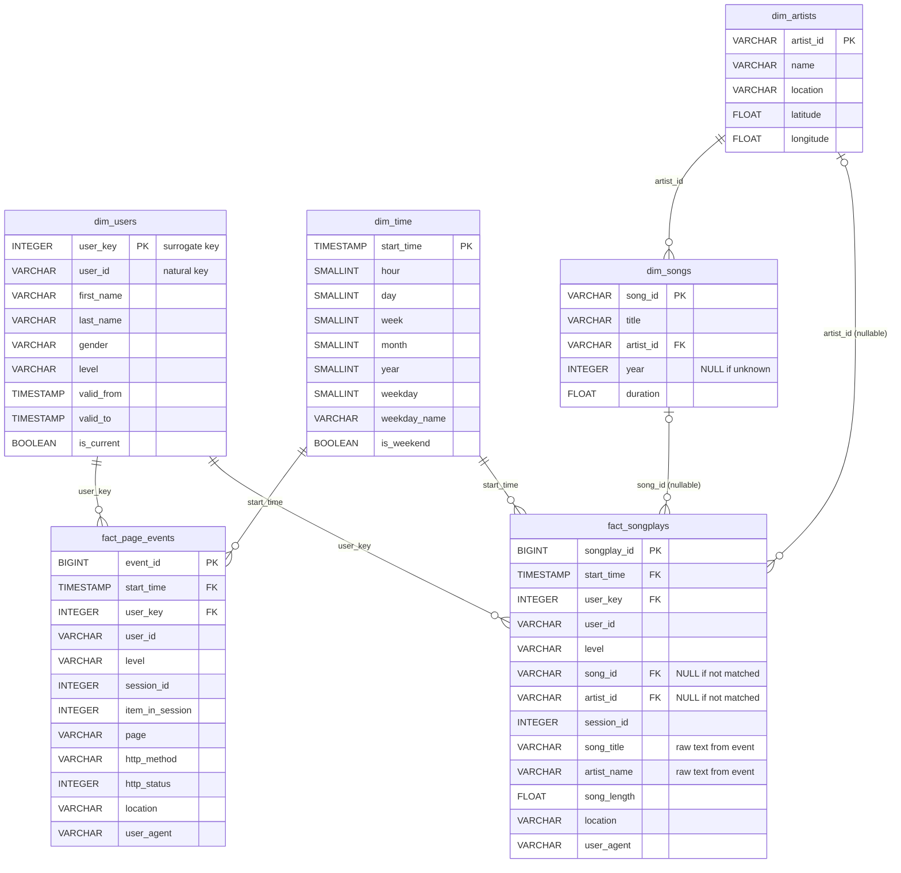

# Data Model — Sparkify Data Warehouse

> GUIDELINE Step 4 · Design only (DDL is written later in `sql/00–02`).
> Evidence for every decision below comes from [`notebooks/01_data_profiling.ipynb`](../notebooks/01_data_profiling.ipynb).

## 1. Overview

A **star schema with two fact tables** (a "fact constellation") sharing conformed dimensions:

| Table | Type | Grain (1 row = …) | Answers |
|---|---|---|---|
| `fact_songplays` | Fact | one song play (`page = 'NextSong'`) by a logged-in user | BQ1, BQ2, BQ5 |
| `fact_page_events` | Fact | one page event of **any** type by a logged-in user | BQ3, BQ4 |
| `dim_users` | Dimension (**SCD Type 2**) | one *version* of a user (a period with the same subscription level) | all |
| `dim_songs` | Dimension | one song | top songs (matched only) |
| `dim_artists` | Dimension | one artist | top artists (matched only) |
| `dim_time` | Dimension | one distinct event timestamp | BQ1 |

Two staging tables (`staging_events`, `staging_songs`) hold the raw JSON as loaded by `COPY` and are not part of the model users query.

## 2. ERD

Editable source: [`docs/erd.drawio`](erd.drawio) (draw.io) · Mermaid source: [`docs/erd.mmd`](erd.mmd)

## 3. Data Dictionary

### `fact_songplays` — 1 row per song play

| Column | Type | Nullable | Source / rule |
|---|---|---|---|
| `songplay_id` | `BIGINT IDENTITY` | No | Surrogate key generated by Redshift |
| `start_time` | `TIMESTAMP` | No | `TIMESTAMP 'epoch' + ts/1000 * INTERVAL '1 second'` (UTC) |
| `user_key` | `INTEGER` | No | `dim_users` version where `start_time` ∈ [`valid_from`, `valid_to`) |
| `user_id` | `VARCHAR(10)` | No | `staging_events.userId` (kept for simple counting of distinct users) |
| `level` | `VARCHAR(10)` | No | `free` / `paid` **at the time of the play** |
| `song_id` | `VARCHAR(18)` | **Yes** | Match on title + artist name + duration; NULL when not in catalog (~95%) |
| `artist_id` | `VARCHAR(18)` | **Yes** | Same match as `song_id` |
| `session_id` | `INTEGER` | No | `sessionId` |
| `song_title` | `VARCHAR(256)` | No | Raw `song` text from the event |
| `artist_name` | `VARCHAR(256)` | No | Raw `artist` text from the event |
| `song_length` | `FLOAT` | No | Raw `length` (seconds) |
| `location` | `VARCHAR(256)` | No | e.g. `San Francisco-Oakland-Hayward, CA` |
| `user_agent` | `VARCHAR(512)` | No | Browser / OS string |

### `fact_page_events` — 1 row per page event (logged-in users)

| Column | Type | Nullable | Source / rule |
|---|---|---|---|
| `event_id` | `BIGINT IDENTITY` | No | Surrogate key |
| `start_time` | `TIMESTAMP` | No | Converted `ts` |
| `user_key` | `INTEGER` | No | SCD2 lookup (as above) |
| `user_id` | `VARCHAR(10)` | No | `userId` |
| `level` | `VARCHAR(10)` | No | Level at the time of the event |
| `session_id` | `INTEGER` | No | `sessionId` |
| `item_in_session` | `INTEGER` | No | Order of the event inside the session (used for funnels) |
| `page` | `VARCHAR(32)` | No | `NextSong`, `Home`, `Upgrade`, `Submit Upgrade`, `Downgrade`, `Submit Downgrade`, … |
| `http_method` | `VARCHAR(8)` | No | `GET` / `PUT` |
| `http_status` | `INTEGER` | No | `200` / `307` / `404` |
| `location` | `VARCHAR(256)` | No | — |
| `user_agent` | `VARCHAR(512)` | No | — |

Logged-out events (`userId = ''`, 286 rows / 3.6%) are excluded from both facts; their count is reported as a data-quality metric.

### `dim_users` — SCD Type 2

| Column | Type | Description |
|---|---|---|
| `user_key` | `INTEGER IDENTITY` | Surrogate key — one per version |
| `user_id` | `VARCHAR(10)` | Natural key from the app |
| `first_name`, `last_name`, `gender` | `VARCHAR` | From the event |
| `level` | `VARCHAR(10)` | Level during this version |
| `valid_from` | `TIMESTAMP` | First event time of this version |
| `valid_to` | `TIMESTAMP` | Start of the next version; `9999-12-31` for the current version |
| `is_current` | `BOOLEAN` | `TRUE` for the latest version of each user |

### `dim_songs`

| Column | Type | Description |
|---|---|---|
| `song_id` | `VARCHAR(18)` | PK |
| `title` | `VARCHAR(256)` | Song title |
| `artist_id` | `VARCHAR(18)` | FK → `dim_artists` |
| `year` | `INTEGER` | Release year; `0` in source → `NULL` (32% of songs) |
| `duration` | `FLOAT` | Seconds |

### `dim_artists`

| Column | Type | Description |
|---|---|---|
| `artist_id` | `VARCHAR(18)` | PK |
| `name` | `VARCHAR(256)` | One name per artist (see §5.2) |
| `location` | `VARCHAR(256)` | Empty string in source → `NULL` |
| `latitude`, `longitude` | `FLOAT` | NULL for 65% of rows |

### `dim_time`

| Column | Type | Description |
|---|---|---|
| `start_time` | `TIMESTAMP` | PK — every distinct timestamp from both fact tables |
| `hour`, `day`, `week`, `month`, `year` | `SMALLINT` | `EXTRACT(...)` |
| `weekday` | `SMALLINT` | 0 = Sunday … 6 = Saturday (`EXTRACT(dow)`) |
| `weekday_name` | `VARCHAR(10)` | `Monday` … — for dashboard labels |
| `is_weekend` | `BOOLEAN` | Saturday or Sunday (BQ1: weekday vs weekend) |

## 4. Redshift Physical Design

| Table | DISTSTYLE | SORTKEY | Reason |
|---|---|---|---|
| `staging_events` | `EVEN` | — | Load-only table, scanned once by the ETL |
| `staging_songs` | `EVEN` | — | Same |
| `fact_songplays` | `AUTO` | `start_time` | `song_id` is NULL for ~95% of rows → `DISTKEY(song_id)` would put almost all rows on **one slice** (skew). Most queries filter/group by time → sort by `start_time` |
| `fact_page_events` | `AUTO` | `start_time` | Same reasoning; funnel queries look at time windows |
| `dim_users` | `ALL` | `user_id` | ~100 rows; a copy on every node removes data movement on joins |
| `dim_songs` | `ALL` | `song_id` | ~15k rows, small enough to replicate; joined by `song_id` |
| `dim_artists` | `ALL` | `artist_id` | ~9.5k rows; joined by `artist_id` |
| `dim_time` | `ALL` | `start_time` | ~8k rows; range-joined by time |

Notes:
- Redshift does **not enforce** PRIMARY KEY / FOREIGN KEY constraints. We still declare them (the optimizer uses them),
  and enforce uniqueness with data-quality checks in `sql/05_data_quality.sql`.
- With a 1-node cluster, DIST style has little effect on speed — the design is written for a production multi-node cluster
  and the reasoning is what matters for the report.

## 5. Transformation Rules

### 5.1 SCD Type 2 for `dim_users`

The ETL is a full rebuild from all events, so versions are derived in one pass:

1. Take all logged-in events, ordered by `user_id`, `ts`.
2. Mark a **new version** whenever `level` differs from the previous event of the same user (`LAG(level)`).
3. `valid_from` = time of the first event of the version.
4. `valid_to` = `valid_from` of the next version (`LEAD`), or `9999-12-31` for the last one → `is_current = TRUE`.
5. Facts look up `user_key` with `e.user_id = u.user_id AND e.start_time >= u.valid_from AND e.start_time < u.valid_to`.

Real example from the data — user `15` goes paid → free → paid within five minutes on 21 Nov:

| user_key | user_id | level | valid_from | valid_to | is_current |
|---|---|---|---|---|---|
| (auto) | 15 | paid | 2018-11-02 09:01:21 | 2018-11-21 11:08:57 | FALSE |
| (auto) | 15 | free | 2018-11-21 11:08:57 | 2018-11-21 11:13:32 | FALSE |
| (auto) | 15 | paid | 2018-11-21 11:13:32 | 9999-12-31 00:00:00 | TRUE |

Expected from profiling: **106 versions** for 97 users (8 users have more than one version; user 15 has three).

> Limitation (for chapter 5): an incremental daily load would need a MERGE that closes the open version
> instead of a full rebuild.

### 5.2 Deduplicating `dim_artists`

396 `artist_id`s appear with more than one `artist_name` (e.g. `Cypress Hill` and `Cypress Hill featuring Kurupt`).
Rule: keep **one row per `artist_id`** using `ROW_NUMBER() OVER (PARTITION BY artist_id ORDER BY LEN(artist_name))`
→ the shortest name is the main artist name. Location / lat / long are taken from the same row, empty strings → `NULL`.

### 5.3 Song matching

`fact_songplays.song_id/artist_id` = `staging_songs` row where `title = song AND artist_name = artist AND duration = length`.
Matching uses `staging_songs` (all name variants), not the deduplicated `dim_artists`, so it is not affected by §5.2.
Expected match rate ≈ 4.7% (319 / 6,820). Because of this, the fact also keeps the raw `song_title` / `artist_name`
so "top songs / top artists" can be shown for **all** plays.

## 6. Changes vs the Reference README (what makes this design ours)

| Reference README | Our design | Why |
|---|---|---|
| One fact table (`fact_songplays`) | + `fact_page_events` | BQ3 upgrade funnel and BQ4 churn risk need non-`NextSong` pages |
| `dim_users` keeps one level per user | **SCD Type 2** with surrogate `user_key` | 8 users change level within the month; the history is exactly what BQ3/BQ4 analyse |
| `DISTKEY(song_id)` on the fact | `DISTSTYLE AUTO` | ~95% NULL `song_id` → data skew |
| `dim_songs SORTKEY(title)` | `SORTKEY(song_id)` | No query filters by title; joins use `song_id` |
| `SELECT DISTINCT` artists | Deduplicate to one row per `artist_id` | Avoid duplicate primary keys (396 cases) |
| Only matched song/artist IDs in the fact | Also raw `song_title`, `artist_name` | Top-N charts would otherwise use only 4.7% of plays |
| `year` copied as-is | `0` → `NULL` | 0 is not a real year; avoids wrong averages |
| `dim_time` without weekend flag | `weekday_name`, `is_weekend` | BQ1 compares weekdays vs weekends |
